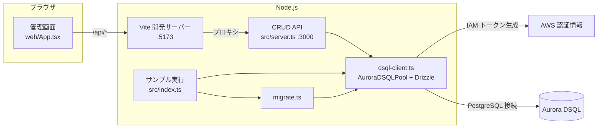
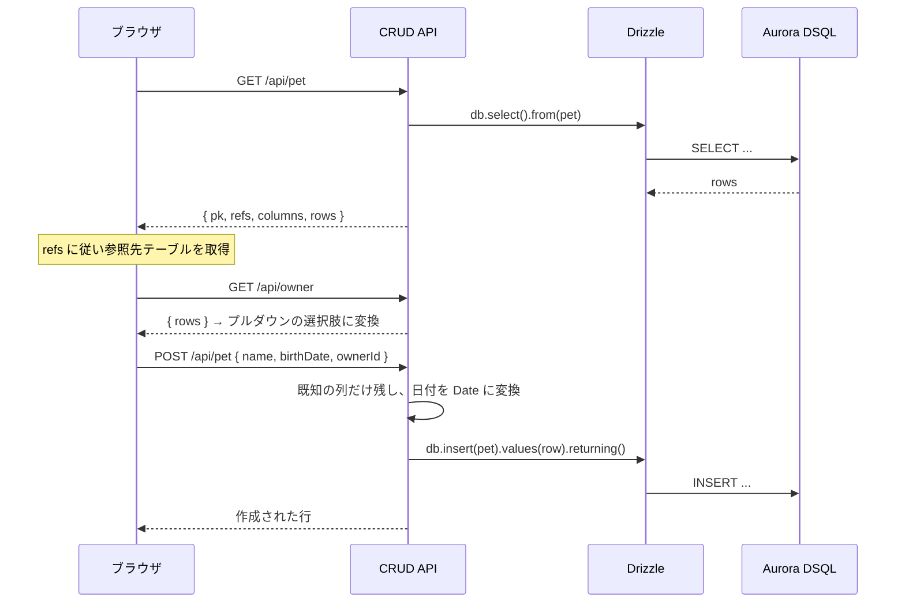

# アーキテクチャ

## 全体構成

このリポジトリは 2 つの実行経路を持ちます。どちらも同じ接続処理 (`src/dsql-client.ts`) とスキーマ定義 (`src/schema.ts`) を共有します。



- **サンプル実行経路** — `npm run sample`。マイグレーションを適用し、`src/example.ts` の CRUD とリレーション取得を実行する。結合テストも同じ経路を通る。
- **管理画面経路** — `npm run api` + `npm run web`。ブラウザからテーブルの中身を確認・編集する。動作確認用であり、サンプルの本筋ではない。

## モジュールの責務

| ファイル                                    | 責務                                                                   |
| ------------------------------------------- | ---------------------------------------------------------------------- |
| [src/schema.ts](../src/schema.ts)           | テーブル定義とリレーション定義。型の単一の情報源                       |
| [src/dsql-client.ts](../src/dsql-client.ts) | 接続プールの生成、IAM 認証、`search_path` の設定                       |
| [src/migrate.ts](../src/migrate.ts)         | DSQL 対応のマイグレーション適用と適用履歴の管理                        |
| [src/example.ts](../src/example.ts)         | CRUD とリレーション取得のサンプル。`assert` で結果を検証する           |
| [src/index.ts](../src/index.ts)             | サンプルのエントリポイント。マイグレーション適用後にサンプルを実行する |
| [src/server.ts](../src/server.ts)           | 管理画面用の CRUD API                                                  |
| [src/utils.ts](../src/utils.ts)             | 必須環境変数の取得。未設定なら起動時に例外を投げる                     |
| [web/App.tsx](../web/App.tsx)               | 管理画面の唯一の画面コンポーネント                                     |

## 接続とスキーマの決定

`createDsqlClient()` は環境変数から接続情報を組み立て、ユーザー名に応じて `search_path` を切り替えます。

```typescript
const searchPath = user === "admin" ? "public" : "myschema";

const pool = new AuroraDSQLPool({
    host,
    user,
    options: `-c search_path=${searchPath}`,
});

const db = drizzle({ client: pool, schema });
```

| `CLUSTER_USER` | 使用スキーマ |
| -------------- | ------------ |
| `admin`        | `public`     |
| それ以外       | `myschema`   |

IAM トークンの生成と自動更新は [Aurora DSQL Connector](https://github.com/awslabs/aurora-dsql-connectors/tree/main/node) が担当するため、アプリケーション側にパスワードや認証情報は現れません。リージョンはホスト名から自動判別されます。

## 管理画面のデータフロー



API は 1 テーブル 1 ハンドラではなく、テーブル定義のレジストリを引く汎用実装になっています。テーブルを追加する際は [src/server.ts](../src/server.ts) の `TABLES` に 1 行足すだけで済みます。

```typescript
const TABLES: Record<
    string,
    { table: PgTable; pk: string; refs?: Record<string, string> }
> = {
    owner: { table: schema.owner, pk: "id" },
    pet: { table: schema.pet, pk: "id", refs: { ownerId: "owner" } },
    vet: { table: schema.vet, pk: "id" },
    specialty: { table: schema.specialty, pk: "name" },
};
```

`refs` は「どの列がどのテーブルを参照するか」の宣言です。Aurora DSQL は外部キー制約を持たないため DB からは辿れず、画面がプルダウンを出すためだけにここで宣言しています。

## 設計上の判断

### 汎用 CRUD ハンドラ

テーブルごとに個別のハンドラを書くより、レジストリを引く 1 組のハンドラのほうが総量が少なく、テーブル追加時の変更点も 1 箇所に収まります。代償として、テーブル固有のバリデーションを書く場所がありません。必要になった時点でレジストリにフックを足すのが素直な拡張です。

### 複合主キーのテーブルを対象外にした理由

`_SpecialtyToVet` は複合主キーのため、`/api/:table/:id` という単一キー前提の URL 設計に乗りません。汎用化のために URL 設計を複雑にするより、必要になったら専用ハンドラを足すほうが安価と判断しました。

### フロントエンドの依存関係

`@vitejs/plugin-react` は使っていません。このパッケージが要求する Babel 8 が、テストで使う Jest の Babel 7 と衝突するためです。代わりに Vite 内蔵の esbuild による JSX 変換を使っています（[vite.config.mts](../vite.config.mts)）。

```typescript
export default defineConfig({
    root: "web",
    esbuild: { jsx: "automatic" },
    server: {
        proxy: { "/api": "http://localhost:3000" },
    },
});
```

代償は Fast Refresh が効かず、編集時にページ全体がリロードされることだけです。

### エラーの原因チェーン展開

Drizzle はドライバのエラーを `Failed query: ...` で包み、本当の原因を `error.cause` に格納します。そのままではエラーメッセージが SQL 文だけになり原因が分からないため、API 側で原因チェーンを連結してから返しています（[src/server.ts](../src/server.ts) の `describe()`）。

```
Failed query: select ... -> relation "owner" does not exist
```

## 既知の制約

| 項目         | 内容                                                                                                                                                      |
| ------------ | --------------------------------------------------------------------------------------------------------------------------------------------------------- |
| 認証         | CRUD API に認証がない。ローカル開発専用                                                                                                                   |
| OCC リトライ | 楽観的同時実行制御の競合（SQLSTATE 40001）に対するリトライは未実装。詳細は [aurora-dsql-drizzle.md](aurora-dsql-drizzle.md#楽観的同時実行制御-occ) を参照 |
| 必須列の表示 | 管理画面が NOT NULL 列を示さないため、未入力のまま追加すると DB のエラーになる                                                                            |
| 一覧の件数   | ページネーションがなく全件取得する。行数が増えると重くなる                                                                                                |
| 主キーの変更 | 主キー列は読み取り専用。`specialty` は主キーしか列がないため編集不可（作成と削除のみ）                                                                    |
