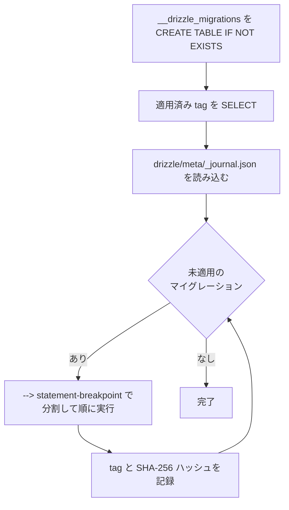

# Aurora DSQL と Drizzle ORM

Aurora DSQL は PostgreSQL 互換の分散データベースですが、互換性は完全ではありません。通常の PostgreSQL 向けの書き方がそのままは通らない箇所と、このリポジトリでの対処をまとめます。

参考: [Building type-safe applications with Drizzle ORM in Aurora DSQL](https://aws.amazon.com/jp/blogs/database/building-type-safe-applications-with-drizzle-orm-in-aurora-dsql/) / [PostgreSQL 互換性と移行ガイド](https://docs.aws.amazon.com/aurora-dsql/latest/userguide/working-with-postgresql-compatibility-migration-guide.html)

## 対処の一覧

| 制約                      | 影響                                  | 本リポジトリでの対処                                |
| ------------------------- | ------------------------------------- | --------------------------------------------------- |
| `SERIAL` 疑似型が使えない | Drizzle 標準の `migrate()` が失敗する | UUID 主キーを使う自前のマイグレーションランナー     |
| 外部キー制約が使えない    | 参照整合性が DB で保証されない        | Drizzle の `relations()` でアプリケーション層で管理 |
| 分散書き込み              | 連番主キーがホットスポットになる      | UUID + `gen_random_uuid()` を主キーに使う           |
| 楽観的同時実行制御 (OCC)  | 競合時に SQLSTATE 40001 で失敗する    | **未実装**（後述）                                  |

## 主キーの設計

Aurora DSQL でも [シーケンスと ID 列](https://docs.aws.amazon.com/aurora-dsql/latest/userguide/sequences-identity-columns.html) は `CACHE` 指定付きで利用できますが、[推奨される既定](https://docs.aws.amazon.com/aurora-dsql/latest/userguide/sequences-identity-columns-working-with.html)は UUID です。連番はキー空間の末尾に書き込みが集中し、分散システムでホットスポットになります。UUID なら書き込みが均等に分散します。

```typescript
import { pgTable, uuid, varchar } from "drizzle-orm/pg-core";
import { sql } from "drizzle-orm";

export const owner = pgTable("owner", {
    id: uuid()
        .primaryKey()
        .default(sql`gen_random_uuid()`),
    name: varchar({ length: 30 }).notNull(),
    city: varchar({ length: 80 }).notNull(),
    telephone: varchar({ length: 20 }),
});
```

値が固定的で件数が少ないマスタテーブルであれば、`specialty` のように意味のある文字列を主キーにしても問題ありません。

```typescript
export const specialty = pgTable("specialty", {
    name: varchar({ length: 80 }).primaryKey(),
});
```

## リレーション

Aurora DSQL は外部キー制約をサポートしません。列自体は普通に定義し、関連は Drizzle の `relations()` で表現します。

```typescript
export const pet = pgTable("pet", {
    id: uuid()
        .primaryKey()
        .default(sql`gen_random_uuid()`),
    name: varchar({ length: 30 }).notNull(),
    birthDate: date({ mode: "date" }).notNull(),
    ownerId: uuid("owner_id"), // FK 制約はない
});

export const petRelations = relations(pet, ({ one }) => ({
    owner: one(owner, {
        fields: [pet.ownerId],
        references: [owner.id],
    }),
}));
```

これにより、型安全な関連取得ができます。

```typescript
const pet1 = await db.query.pet.findFirst({
    where: eq(pet.name, "Pet1"),
    with: { owner: true },
});

pet1.owner?.name; // 型が付く
```

`relations()` はあくまでクエリビルダ向けの宣言です。**DB は整合性を検査しません**。存在しない `ownerId` を書き込めますし、親行を削除しても子行は残ります。孤児レコードを避けたい場合は、削除順をアプリケーション側で制御する必要があります（[src/example.ts](../src/example.ts) の `cleanup()` は子から順に削除しています）。

多対多は中間テーブルを明示的に定義します。

```typescript
export const specialtyToVet = pgTable(
    "_SpecialtyToVet",
    {
        specialtyName: varchar("A", { length: 80 }).notNull(),
        vetId: uuid("B").notNull(),
    },
    (t) => [primaryKey({ columns: [t.specialtyName, t.vetId] })],
);
```

## マイグレーション

### 標準の `migrate()` が使えない理由

Drizzle 標準の `migrate()` は、適用履歴を記録する追跡テーブルを `SERIAL` 型で作成します。Aurora DSQL は `SERIAL` 疑似型をサポートしないため、この時点で失敗します。

このリポジトリでは、UUID 主キーで同等の処理を行う自前のランナー [src/migrate.ts](../src/migrate.ts) を使います。

```typescript
import { applyMigrations } from "./migrate";

await applyMigrations(pool, "./drizzle");
```

### 動作



追跡テーブルは UUID 主キーで作られます。

```sql
CREATE TABLE IF NOT EXISTS "__drizzle_migrations" (
    id uuid PRIMARY KEY DEFAULT gen_random_uuid(),
    hash text NOT NULL,
    tag text NOT NULL,
    created_at bigint
)
```

### SQL の生成

スキーマ変更後は SQL を生成します。生成は静的解析のみで行われるため、DB 接続は不要です。

```bash
npm run migrate:generate
```

`drizzle.config.ts` の設定に従い、`src/schema.ts` から `drizzle/` に出力されます。

```typescript
export default defineConfig({
    dialect: "postgresql",
    schema: "./src/schema.ts",
    out: "./drizzle",
});
```

生成された SQL は `--> statement-breakpoint` で区切られており、ランナーはこの区切りで分割して 1 文ずつ実行します。

### 注意点

- 各マイグレーションは**トランザクションで包まれていません**。途中で失敗すると、それまでの文は適用されたまま残ります。
- ハッシュは記録するだけで、適用済みマイグレーションの改変検知には使っていません。適用済みの SQL ファイルは編集せず、新しいマイグレーションを追加してください。

## IAM 認証

接続は [Aurora DSQL Connector](https://github.com/awslabs/aurora-dsql-connectors/tree/main/node) が担当します。短命な IAM トークンの生成と自動更新を行うため、アプリケーション側にパスワードは現れません。

```typescript
const pool = new AuroraDSQLPool({
    host,
    user,
    options: `-c search_path=${searchPath}`,
});

const db = drizzle({ client: pool, schema });
```

- リージョンはホスト名から自動判別されるため、`AWS_REGION` の指定は不要です。
- 認証情報は AWS SDK の標準的な解決順序（プロファイル、環境変数、インスタンスロールなど）に従います。
- `search_path` は接続オプションで設定します。**ユーザー入力をそのまま埋め込まないでください**。このリポジトリでは `admin` かどうかで固定値 (`public` / `myschema`) を選ぶ実装になっています。

```typescript
const searchPath = user === ADMIN ? ADMIN_SCHEMA : NON_ADMIN_SCHEMA;
```

## 楽観的同時実行制御 (OCC)

Aurora DSQL はロックではなく楽観的同時実行制御を使います。同じ行を同時に更新した場合、後から commit したトランザクションが SQLSTATE `40001` で失敗します。これは異常ではなく通常の動作であり、**アプリケーション側でリトライする前提**です。

参考記事では、指数バックオフとジッターを併用した `withRetry()` パターンが推奨されています。

> **このリポジトリには OCC リトライは実装されていません。** サンプルもテストも単一プロセスの逐次実行で、競合が起きない前提のコードになっています。同時更新が発生する用途に転用する場合は、リトライの実装が必要です。

実装する場合の骨子は次の通りです（未実装・参考）。

```typescript
// SQLSTATE 40001 のときだけ、指数バックオフ + ジッターでリトライする
async function withRetry<T>(fn: () => Promise<T>, attempts = 3): Promise<T> {
    for (let i = 0; ; i++) {
        try {
            return await fn();
        } catch (e) {
            const code = (e as { cause?: { code?: string } }).cause?.code;
            if (code !== "40001" || i >= attempts - 1) throw e;
            const backoff = 2 ** i * 50;
            await new Promise((r) =>
                setTimeout(r, backoff + Math.random() * 50),
            );
        }
    }
}
```

Drizzle はドライバのエラーを包むため、SQLSTATE は `error.cause` 側にある点に注意してください（[architecture.md](architecture.md#エラーの原因チェーン展開)）。

## 型の扱い

`date` 列を `mode: "date"` で定義すると、Drizzle は JavaScript の `Date` を要求し、`Date` を返します。

```typescript
birthDate: date({ mode: "date" }).notNull(),
```

```typescript
await db.insert(pet).values({
    name: "Pet1",
    birthDate: new Date("2006-10-25"), // 文字列は不可
    ownerId: john.id,
});
```

JSON API のように文字列で値を受け取る層では、変換が必要になります。[src/server.ts](../src/server.ts) は列のメタ情報を見て変換しています。

```typescript
} else if (column.dataType === "date") {
    const date = new Date(String(value));
    if (Number.isNaN(date.getTime())) {
        throw new HttpError(400, `Invalid date for ${name}: ${value}`);
    }
    row[name] = date;
}
```

JSON にシリアライズすると `Date` は UTC の ISO 文字列 (`"2021-03-03T00:00:00.000Z"`) になります。日付として表示する際は日付部分だけを取り出す必要があります。
